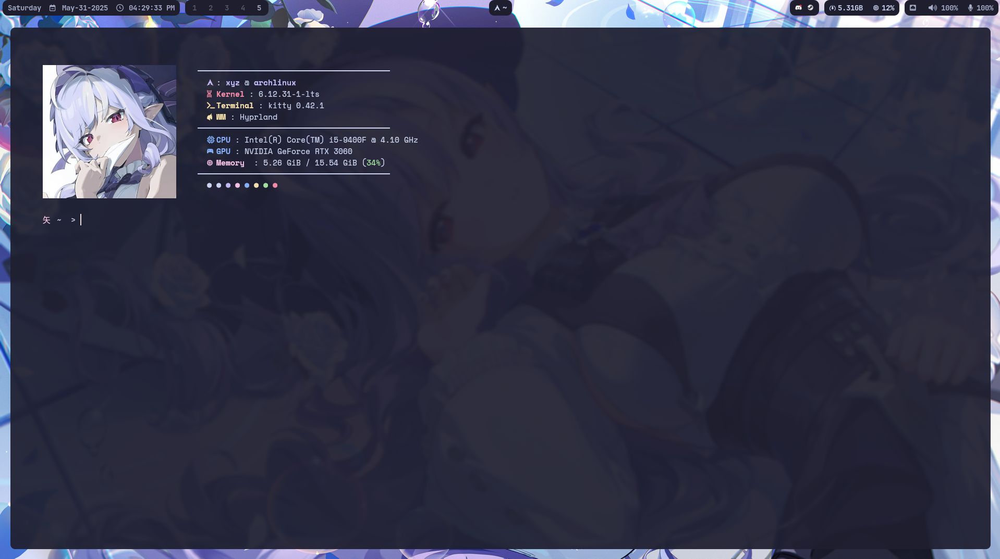
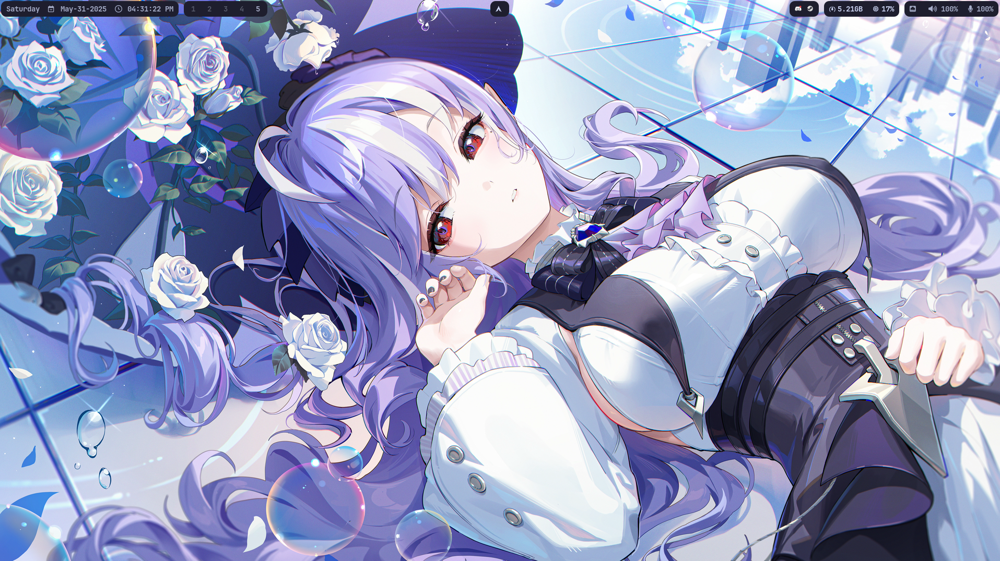

# xyz dotfiles

Configurações pessoais para Arch Linux com Hyprland, Inclui setups para terminal, editor, waybar, notificações e mais. 
## 🖼️ Preview


## Desktop



#### obs: nem tudo foi eu quem criou

## 📦 Dependências

Antes de usar, instale os seguintes pacotes:

### 🖥️ Ambiente gráfico (Wayland)
- [Hyprland](https://github.com/hyprwm/Hyprland)
- [Waybar](https://github.com/Alexays/Waybar)
- `wl-clipboard` `waypaper` `grim` `slurp` `hyprpaper`

### 🧰 Utilitários
- `kitty` (terminal)
- `fish` (shell)
- `neovim` (editor)
- `rofi` (menu de apps)
- `dunst` (notificações)
- `fastfetch` (splash info)
- `pavucontrol` (controle de mídia)
- `mpd` + `ncmpcpp` (player de música)
- `btop` ou `htop` (monitor do sistema)
- `grim` e `slurp` (print)
- `hyprpaper`,`swww` e `waypaper` (ferramenta para wallpaper)

### 🎨 Aparência
- [JetBrains Mono Nerd Font](https://www.nerdfonts.com/font-downloads)
- `papirus-icon-theme`
- `qt5ct` `qt6ct` (opcional, para temas Qt)

### 📁 Gerenciador de arquivos (opcional)
- `dolphin`

## 🚀 Instalação

1. Clone os dotfiles:
   ```bash
   git clone https://github.com/naoeoxyz/dotfiles ~/.dotfiles

2. Crie links simbólicos (ou copie) para os diretórios de configuração:

   ```bash
   ln -s ~/.dotfiles/hypr ~/.config/hypr
   ln -s ~/.dotfiles/waybar ~/.config/waybar
   ln -s ~/.dotfiles/kitty ~/.config/kitty
   ln -s ~/.dotfiles/fish ~/.config/fish
   ln -s ~/.dotfiles/nvim ~/.config/nvim
   ln -s ~/.dotfiles/rofi ~/.config/rofi
   ln -s ~/.dotfiles/dunst ~/.config/dunst
3. Torne o Fish seu shell padrão (opcional):
   ```bash
   chsh -s /usr/bin/fish

## Atalhos de Teclado (Keybindings)
| Atalho                | Ação                               |
| --------------------- | ---------------------------------- |
| `Super + T`           | Abrir terminal (Kitty)             |
| `Super + Q`           | Fechar janela                      |
| `Super + A`           | Abrir launcher (Rofi)              |
| `Super + F`           | Alternar modo fullscreen           |
| `Super + W`           | Alternar layout (split/floating)   |
| `Super + Esc`         | Esconde a waybar/Abre a waybar     |
| `Super + P`           | Captura de tela (grim + slurp)     |
| `Super + 1-9`         | Navega entre as workspaces         |
| `Super + Shift + 1-9` | Move a janela entre as workspaces  |
| `Super + Shift +Setas`| Move as janelas                    |


